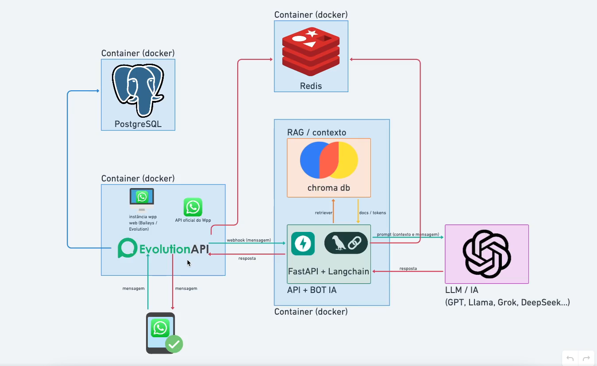

# 🤖 Whatsapp AI Bot

An intelligent WhatsApp chatbot powered by **OpenAI**, **FastAPI**, **LangChain**, and **EvolutionAPI**—designed with a production-ready architecture using **Docker**!  
Perfect for building automated assistants, customer support bots, or implementing RAG (Retrieval-Augmented Generation) with your documents.


---

## ✨ Features

- 🤖 Automatically responds to WhatsApp messages using AI (OpenAI)
- 📚 RAG support: retrieve answers from your own documents
- 🔗 Seamless integration with EvolutionAPI (WhatsApp gateway)
- ⚡ Fast, buffered responses with smart debouncing
- 🧠 Customizable prompts to fine-tune the bot’s behavior
- 🐳 Easy deployment with Docker/Docker Compose

---

## 🚀 Getting Started

### 1. Clone the repository

```bash
git clone https://github.com/yagosamu/whatsapp_ai_bot
cd whatsapp_ai_bot
```

### 2. Configure your environment variables

Copy the example env file and edit as needed:

```bash
cp .env.example .env
```

Fill in the variables in `.env`:

- `OPENAI_API_KEY`: your OpenAI API key
- `AUTHENTICATION_API_KEY`: your EvolutionAPI key
- `EVOLUTION_INSTANCE_NAME`: your instance name in EvolutionAPI (must match the dashboard)
- `AI_CONTEXTUALIZE_PROMPT`, `AI_SYSTEM_PROMPT`: customize your bot’s prompts
- Other variables for Redis, etc.

### 3. (Optional) Add documents for RAG

Place files (PDF, TXT, etc.) in the `rag_files/` folder.  
They will be automatically read and indexed for document-based answers.

### 4. Start the containers

```bash
docker compose up --build
```

Access the EvolutionAPI dashboard at [http://localhost:8080/manager](http://localhost:8080/manager).

### 5. Set up the webhook in EvolutionAPI

- Connect your WhatsApp instance in the dashboard
- Add the webhook:  
  ```
  http://bot:8000/webhook
  ```
- Enable the `MESSAGES_UPSERT` event

---

## 🛠️ Project Structure

```
├── app.py                # FastAPI webhook endpoint
├── evolution_api.py      # Functions for sending messages via EvolutionAPI
├── chains.py             # Agent logic (OpenAI/LangChain)
├── message_buffer.py     # Message buffering and debouncing
├── prompts.py            # Customizable prompts
├── config.py             # Loads .env variables
├── requirements.txt
├── docker-compose.yml
├── Dockerfile
├── rag_files/            # RAG documents
└── ...
```

---

## 💡 Customization

- Modify the prompts in `.env` to change the bot’s “personality” and role
- Add documents to `rag_files/` for use as a knowledge base
- Adapt the code for new integrations, workflows, or behaviors

---

## 🏁 Tips

- Use Docker to avoid dependency issues!
- For production, update the EvolutionAPI URLs and secure your webhook.
- Check the [EvolutionAPI dashboard](https://doc.evolution-api.com/) for more options.
